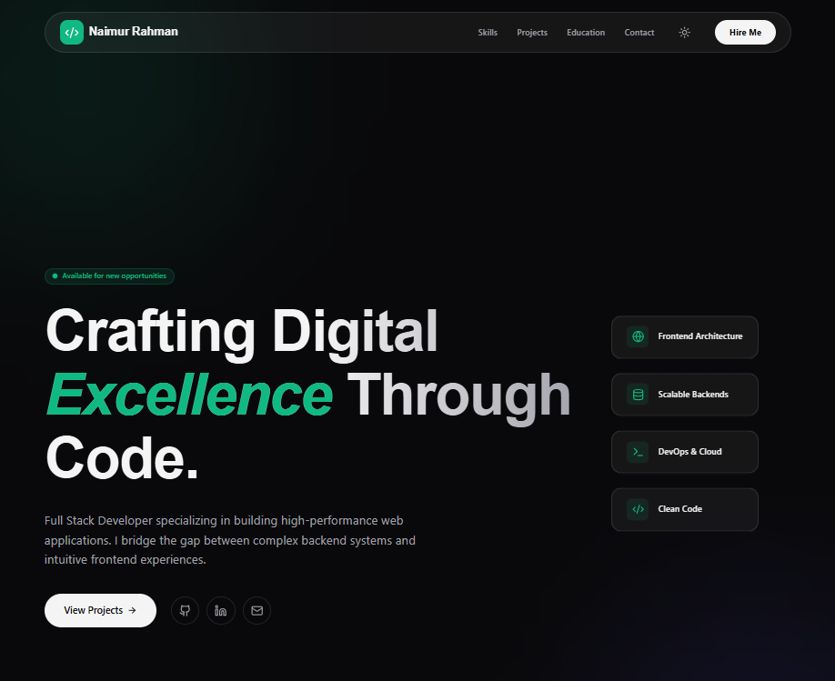

<div align="center">

</div>

# 🚀My Personal Portfolio Website

📬 Contact:

Naimur Rahman
📧 nmrahman1652@gmail.com
📍 Dhaka, Bangladesh

A modern developer portfolio built using React, Tailwind CSS, and Framer Motion.

## Live Demo
https://naimurs-portfolio.vercel.app/

---

## Features

- Modern glassmorphism UI
- Smooth animations (Framer Motion)
- Responsive design
- WhatsApp contact integration
- File upload support
- Toast notifications

---

## Tech Stack

- React
- TypeScript
- Tailwind CSS
- Framer Motion
- React Hot Toast
- Lucide Icons

---

## Run Locally

### Prerequisites
- Node.js (v18+)

### Installation

```bash
npm install
npm run dev
